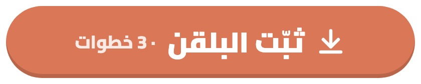
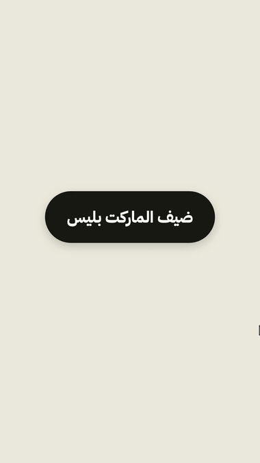
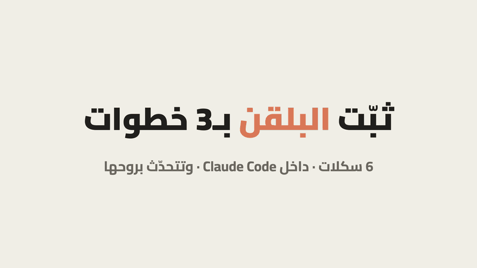
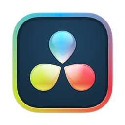

<div dir="rtl">

<p align="center"></p>

<p align="center"><b>تتكلم للكاميرا… وتستلم ريل عمودي جاهز للنشر.</b><br>
يشيل السكتات، يكتب كابشن عربي يمشي مع فمك، ويرسم موشن قرافيكس بألوانك — بلا برنامج مونتاج، وفيديوك ما يطلع من جهازك.</p>

<p align="center"><a href="https://github.com/majedphotos/video-ad-editor/releases/latest/download/majed-video.plugin"></a></p>

<a id="install"></a>

## ⚡ ثبّت البلقن — ثلاث طرق

**البلقن = 6 سكلات بحزمة وحدة** (ريل · موشن · بودكاست · مونتاج · كفر وثمبنيل · دافنشي).

> ☝️ **اختر طريقة وحدة بس** — لو ثبّتّه بأكثر من طريقة يصير عندك نسخ مكررة من نفس السكلات. عندك أكثر من وحدة؟ شيل النسخ الزايدة من **Customize ← Plugins**.

> 🏷️ **ثلاثة أسماء مختلفة، لا تتلخبط:** اسم المستودع `video-ad-editor` · اسم المتجر اللي يظهر لك `majed-video` · اسم البلقن `majed-video`. الأمر الأول ياخذ اسم **المستودع**، والثاني اسم **البلقن@المتجر**.

### ⭐ الأحدث — من claude.ai: تتحدّث بروحها وتوصل الجوال والديسكتوب

<p align="center"></p>
<p align="center"><sub>الخطوات بثواني: Add marketplace ← الصق <code>majedphotos/majed-plugins</code> ← فعّل التحديث التلقائي ← يطلع بالديسكتوب والجوال</sub></p>

1. افتح **claude.ai** (أو تطبيق الديسكتوب) ← **Customize** ← **Plugins** ← **Add** ← **Add marketplace**
2. اكتب: `majedphotos/majed-plugins` (فيه بلقن الفيديو + بلقن مصنع المحتوى) — أو `majedphotos/video-ad-editor` لبلقن الفيديو بس
3. فعّل **Sync automatically** وأضف البلقن. يطلع لك بالويب والديسكتوب والجوال، وClaude Code يسحبه عند بداية أول جلسة.

> المستودع عام، ما تحتاج تنصب شي ثاني. كل إصدار جديد يوصلك لحاله (أو اضغط **Check for updates**).

### الطريقة الثانية — حمّل وارفع

1. [**حمّل البلقن**](https://github.com/majedphotos/video-ad-editor/releases/latest/download/majed-video.plugin) (ملف `majed-video.plugin`)
2. افتح تطبيق **كلود** ← **Customize** ← **Plugins** ← **Upload plugin** ← اختر الملف

> ⚠️ هالطريقة **ما تتحدّث بروحها** — كل نسخة جديدة حمّلها وارفعها من جديد.

### الطريقة الثالثة — من الطرفية (تيرمنال)

**تحتاج Claude Code منصّب.** افتح الطرفية (تيرمنال) — **Terminal** بالماك أو **PowerShell** بالويندوز (مو تبويب Code بتطبيق الديسكتوب) — واكتب `claude --version`. طلع لك رقم نسخة؟ كمّل. طلع `command not found: claude`؟ Claude Code مو عندك — **استخدم الطريقة الأولى**، ما تحتاج شي ثاني.

الصق الأوامر **واحد واحد** (الأمر ← Enter ← انتظر):

<div dir="ltr">

```
claude plugin marketplace add majedphotos/video-ad-editor
```

```
claude plugin marketplace list
```

```
claude plugin install majed-video@majed-video
```

</div>

- **تحقق بعد الأمر الأول:** الأمر الثاني (`marketplace list`) **لازم يظهر فيه `majed-video`**. ما ظهر؟ شغّل الأمر الأول مرة ثانية (لو الاتصال تقطّع)، وبعدها ارجع للقائمة.
- **طلع لك `Failed to add marketplace … extraKnownMarketplaces`؟** لا تكمّل على أساس إنه «مضاف من قبل». شغّل `claude plugin marketplace list` — لو `majed-video` ما يظهر، المتجر ناقص فعلاً: أعد الأمر الأول.
- **أعد تشغيل `claude`** بعد التثبيت، وإلا ما تظهر السكلات بالجلسة.

بعدها **شغّل التحديث التلقائي**: بالطرفية (تيرمنال) العادية اكتب `claude` ← Enter، وبعدين:

<div dir="ltr">

```
/plugin  →  Marketplaces  →  majed-video  →  Enable auto-update
```

</div>

> ℹ️ أمر `/plugin` تفاعلي ويشتغل **بالطرفية (تيرمنال) العادية بس** — ما يشتغل داخل تطبيق الديسكتوب (تبويب Code). وخطوة «Enable auto-update» تظهر فقط لو `marketplace list` فيه `majed-video`.

<p align="center"></p>

> 🔁 **تبي آخر نسخة الحين؟** بالطرفية (تيرمنال): `claude plugin update majed-video@majed-video`
>
> 🧹 **منصّب النسخة القديمة كسكل (ملف `.skill`)؟** شيلها حتى ما تتكرر — البلقن فيه كل شي.
>
> 📦 **تبي سكل الريل بروحه؟** [نزّل `video-ad-editor.skill`](https://github.com/majedphotos/video-ad-editor/releases/latest/download/video-ad-editor.skill) ← دبل كليك ← وافق. (سكل وحدة بكل الأوضاع، بس ما فيها باقي سكلات البلقن)
>
> 📱 **من الجوال أو المتصفح (v4.3.5):** المونتاج يشتغل بالسحابة — **أرفق الفيديو بمحادثة كلود** واطلب، والجوال يقدر يقفل والنتيجة تنتظرك بالمحادثة. ثبّت البلقن **مرة وحدة** من `claude.ai` ← **Customize** ← **Plugins** ← **Upload plugin** (حمّل الملف أول من الرابط فوق)، وبعدها يشتغل بمحادثاتك. السحابة أبطأ من جهازك (قص الشخص ≈ 18 دقيقة لفيديو 40 ثانية)، والتفاصيل: [`phone-cloud-playbook.md`](video-ad-editor/references/phone-cloud-playbook.md).
>
> 🤖 **كودكس وأي وكيل يشغّل أوامر:** يقرأ `SKILL.md` ومجلد `references/` كتعليمات ويشغّل نفس السكربتات ([`any-environment.md`](video-ad-editor/references/any-environment.md)) — *غير مجرَّب بعد على كودكس نفسه.*

<p align="center">🎬 <b>فيديو كامل منتجه البلقن:</b></p>

https://github.com/user-attachments/assets/1047c4e8-141c-4f45-b601-c58d1353fe4c

<table width="100%"><tr>
<td width="38%" align="center"></td>
<td width="62%">

###  دافنشي — وعدّل بإيدك
عندك **دافنشي ريزولف ستوديو**؟ نفس العقل ونفس القواعد، والمخرج تايملاين داخل مشروعك:
- **الفيديو** بمسار، **الرسم** بمسار، و**الكابشن** جملة جملة — كل قطعة تقصها وتسحبها لحالها
- **النص يتعدّل** من الإنسبكتر: الكلام، الكلمة المظلّلة، المكان، والألوان
- قل له: **«سوّه بدافنشي»**

> ⚠️ **أي نسخة؟** دافنشي ريزولف **ستوديو** (المدفوعة) **من موقع بلاك ماجك** — فيها البرمجة اللي يتصل فيها Claude (إم سي بي).
>
> ❌ **لا تشتريها من آب ستور الماك:** نسخة آب ستور ما فيها البرمجة أبداً، فـClaude ما يقدر يتحكم فيها — وترخيصها ما يتحوّل للنسخة الثانية.
>
> ❌ **المجانية** من 21.1 شالوا منها البرمجة.

</td></tr></table>

## 🎬 داخل البلقن — 6 سكلات، كل وحدة لشغلة

<table width="100%"><tr>
<td width="25%" align="center" valign="top"><br><b>🎙️ ريل من فيديو كلام</b><br><sub>سكتات أقل · كابشن بتوقيت الكلمة · موشن من معنى كلامك</sub><br><code>«منتج هذا المقطع»</code></td>
<td width="25%" align="center" valign="top"><br><b>✨ شرح بالموشن</b><br><sub>فيلم 3D بـ60 فريم من نص · شرح موقع وتطبيق بآيفون وماك بوك 3D</sub><br><code>«سو فيديو موشن من هالنص»</code></td>
<td width="25%" align="center" valign="top"><br><b>🎧 بودكاست ومقابلات</b><br><sub>كاميرتين ← ريلات بهوك مكتوب · الحلقة كاملة 16:9</sub><br><code>«سو ريلات من الحلقة»</code></td>
<td width="25%" align="center" valign="top"><br><b>🎞️ مونتاج مقاطع</b><br><sub>مجلد مقاطع بلا كلام ← ريل على الإيقاع</sub><br><code>«مونتاج من هالمقاطع»</code></td>
</tr></table>

## 🖼️ كفر وثمبنيل ينقرون بالجوال
<table width="100%"><tr>
<td width="30%" align="center"><br><sub>كفر الريل = أول فريم</sub></td>
<td width="70%">

شبكة البروفايل تصغّر الكفر لـ**12٪** من حجمه — فأغلب الكفرات ما تنقرا. البلقن يصمم بأحجام مقاسة على شاشة الجوال:
- **كفر الريل:** كل المهم داخل مربع 1:1 بالنص (يبين صح بالبروفايل 3:4 والفيد 4:5)، العنوان ≥ 170 بكسل و5 كلمات بالكثير — ويتركّب **أول فريم بالفيديو**
- **ثمبنيل يوتيوب:** ثلاث أفكار بـ3840×2160 — وجه كبير، هوك قصير، وتحت يمين فاضي لمدة الفيديو
- **صورتك من الفيديو** (يختار أوضح فريم ويقصّك) **أو من صورك** — يسألك أول · وخلفية كريمية هادية
- **التصميم من موضوع فيديوك** كل مرة: العنوان من كلامك والشعارات من اللي تتكلم عنه — مو قالب
- **معاينة بحجمه الحقيقي بالجوال** قبل ما تنشر
- قل له: **«سو كفر»** أو **«ثمبنيل يوتيوب»**


</td></tr></table>

## ✂️ امسح من الكلام — ينقص من الفيديو
بعد التفريغ يطبع لك كلامك جملة جملة. تقول له **«شيل 5 و8»** — ويقصهم من الفيديو والصوت، والكابشن يمشي معاه. غيّرت رايك؟ **«رجّعها»**. ويكشف بروحه الجمل اللي قلتها مرتين.

## 🧭 يتعرّف على ذوقك — أول مرة بس
<p align="center"></p>

صفحة صغيرة تختار فيها ألوانك، الخط، ستايل الكابشن، الإيقاع، والصوت — أو تكتب اللي تبيه وتخطّاها. كل فيديو بعدها يمشي على ذوقك.

## 🎚️ تايملاين تعدّل عليه — من الكمبيوتر أو الجوال
<p align="center"> </p>

كلود يسوي المونتاج، وانت تعدّل بإيدك: تقص، تغيّر ستايل الكابشن، تحط مؤثر على كلمة، ترفع بي-رول من جوالك — وكل تعديل ما يصرف توكنز. تبي تحكم كامل بكل فريم؟ **«افتحه بريموشن»**:

<p align="center"></p>

## 🔌 استخدم اللي عندك
عندك اشتراك بمنصة توليد (fal · Higgsfield · ElevenLabs · أو غيرها) وكونكتورها مركّب بكلود؟ قل له يستخدمها — يولّد منها البي-رول أو الصوت أو المشاهد ويركّبها بالمونتاج. ما عندك؟ يشتغل عادي بدونها.

## 🆕 جديد في 4.3
- **صار بلقن واضح:** 6 سكلات بحزمة وحدة — والسادسة **دافنشي** بروحها («سوّه بدافنشي»).
- **فيديو تعليمي للتثبيت** فوق الصفحة + التحديث التلقائي.

## جديد في 4.2
- **الكفر والثمبنيل:** صورتك من الفيديو نفسه (قصّ آلي) أو من صورك · خلفية كريمية · الوجه أكبر بفكرة «قبل/بعد».
- **دافنشي:** شنو النسخة اللي تشتغل (ستوديو من موقع بلاك ماجك — مو آب ستور).

## جديد في 4.1
- **سكل الكفر والثمبنيل** (`thumbnail-video`) — أحجام تنقرا بالجوال (مقاسة + بحث)، كفر أول فريم، وثمبنيل يوتيوب بثلاث أفكار.

## جديد في 4.0
- **أربع سكلات بمحرّك واحد** بدل سكل واحد ثقيل — كل وضع يقرا تعليماته بس.
- **صفحة التعارف** صارت للكل.
- **وضع دافنشي** صار للكل — وقابل للتعديل: كل شي قطعة على مساره.
- **تعليمات مرتبة** — الملف الرئيسي أخف بـ38٪.
- **اختبار آلي** يمر على كل الخطوات قبل أي إصدار.

## 🗣️ قل له

| تبي | اكتب |
|---|---|
| ريل من فيديو تتكلم فيه | «منتج هذا المقطع» |
| نفس الريل بدافنشي | «سوّه بدافنشي» |
| مونتاج من مقاطع | «مونتاج من هالمقاطع» |
| ريلات من بودكاست | «سو ريلات من الحلقة» |
| الحلقة كاملة لليوتيوب | «الحلقة كاملة بالعرض» |
| فيديو موشن من نص | «سو فيديو موشن من هالنص» |
| شرح موقع | «اشرح هالموقع بفيديو: الرابط» |
| ثيم من صور | أرسل الصور + «أبي ستايل جذي» |
| كفر أو ثمبنيل | «سو كفر» · «ثمبنيل يوتيوب» |
| تعدّل بنفسك | «افتح الاستوديو» |
| تغيّر ذوقك | «غيّر إعداداتي» |

## 🔧 المتطلبات
البلقن ينزّلها بنفسه بعد إذنك: **ffmpeg** (القص والصوت) · **Whisper** (التفريغ بتوقيت الكلمة) · **Chrome** (الرسم). ماك وويندوز. وضع دافنشي يحتاج **دافنشي ريزولف ستوديو 21.1** أو أحدث — من موقع بلاك ماجك، مو من آب ستور (ما فيها البرمجة).

## 🔒 الخصوصية
كل شي على جهازك. **فيديوك ما يرتفع لأي سيرفر.** الاستثناءات اختيارية وتشغّلها أنت (المشاهد المولّدة بالذكاء الاصطناعي).

## 🎓 البلقن مجاني — الدورة تعلّمك شلون تسوي مثله وأكثر
كل اللي فوق انبنى بكلود. بالدورة تتعلم شلون تبني أدواتك انت: سكلات، أتمتة، ومحتوى يشتغل لك — من الصفر وبالعربي.

<p align="center">
  <a href="https://www.dawrat.com/course/ahtrf-klwd-90f4"></a>
  <a href="https://www.instagram.com/channel/Abb1FvYoeUSGuaVM/"></a>
</p>

## 💬 كلمة بآخر الريل ← رابط بالخاص (اختياري)

ريلات الحلقة تنتهي بـ«اكتب [كلمة] توصلك الحلقة كاملة». عشان الرد يصير تلقائي: [زورجا](https://zorcha.com) — الأوتوميشن مجاني، والتحكم فيه من كلود (MCP) باشتراك. كود **MAJED** (كود شراكة) يعطيك **15% على الخطة الربع سنوية و30% على السنوية**. التفاصيل: [`keyword-automation.md`](video-ad-editor/references/keyword-automation.md).

## 🛠️ للمطوّرين
خريطة كل السكربتات والملفات: [`references/script-map.md`](video-ad-editor/references/script-map.md) · التعليمات: [`SKILL.md`](video-ad-editor/SKILL.md) · السكلات الثانية: [`motion-video`](motion-video/SKILL.md) · [`podcast-video`](podcast-video/SKILL.md) · [`montage-video`](montage-video/SKILL.md) · [`thumbnail-video`](thumbnail-video/SKILL.md) · [`davinci-video`](davinci-video/SKILL.md)

<details><summary>الإصدارات السابقة</summary>

- **4.4.0** وضع «الونشوت» (فيديو كله لقطة وحدة بلا قص) + مثال شغّال `motion/examples/one-take/` + مكتبة أمثلة من الناس (`references/examples.md`) + التثبيت من claude.ai بإضافة الماركت بليس
- **4.3.5** إصلاح «Zip cannot contain nested zip files» (كان بـ4.3.3 و4.3.4) · **4.3.4** يشتغل بالجوال والسحابة · **4.3.3** أقل من 200 ملف

- **3.9** الثيم من صور مرجعية · البودكاست كامل 16:9 · شرح موقع/تطبيق + آيفون وماك بوك 3D · كفر الريل · تنظيف صوت ذكي
- **3.8** شرح بالموشن 3D · هوك البودكاست · «طبقات» · مؤثرات الإيقاع
- **3.6-3.7** حزمة الموشن · الموشن من معنى الجملة
- **3.5** حلقة كاملة ← ريلات
- **3.4** الاستوديو (تايملاين باليد)
- **3.3** أخف وأنظف · **3.2** مشاهد مولّدة · **3.1** حركات الكلمة العربية
- **3.0** يحدّث نفسه · **2.9** تسجيل الشاشة بإطار جوال · **2.8** ويندوز (بمساهمة [@thefhiter](https://github.com/thefhiter)) · **2.7** البودكاست
</details>

## الرخصة
MIT — استخدمه وعدّله ووزّعه بحرية.

</div>
