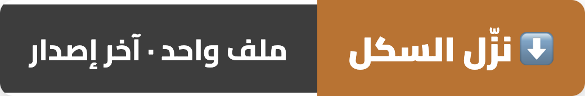
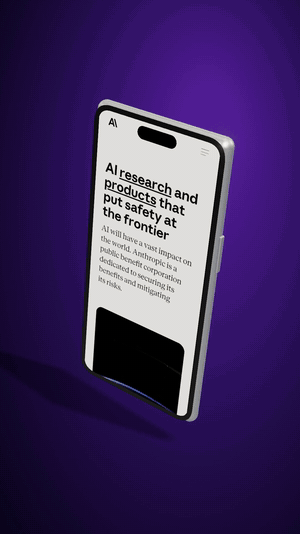
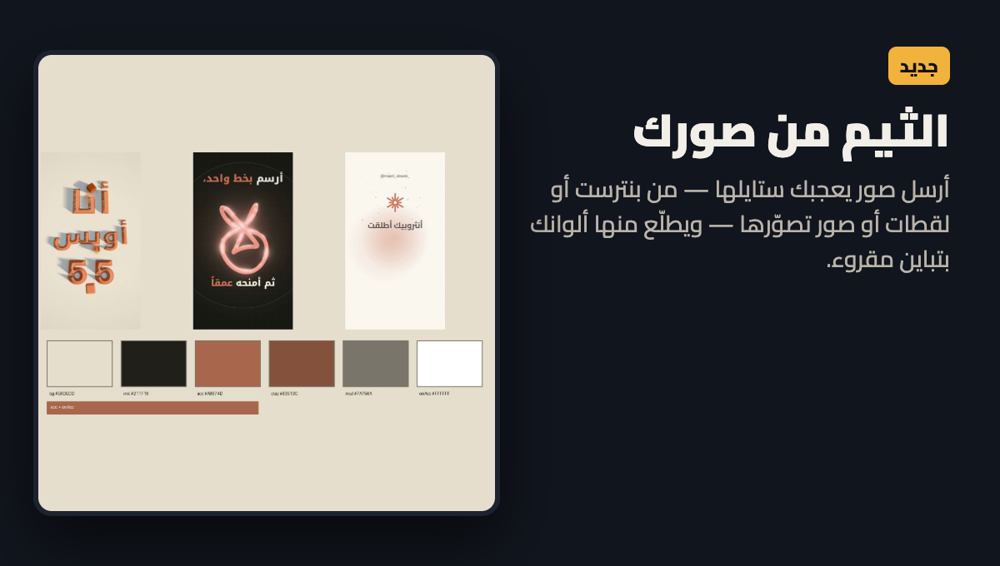
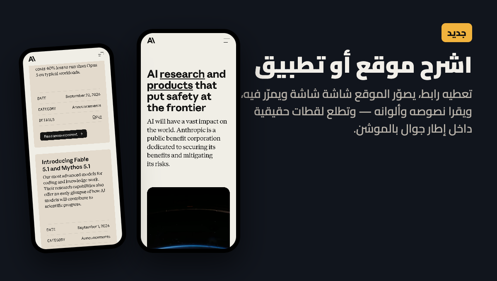
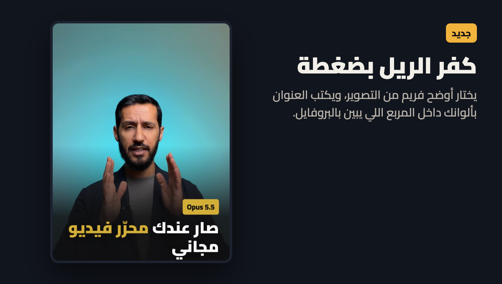
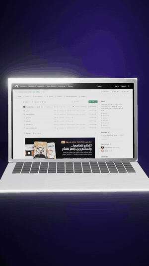

  

<b>تتكلم للكاميرا… وتستلم ريل عمودي جاهز للنشر.</b> 
يشيل السكتات، يكتب كابشن عربي يمشي مع فمك، ويرسم موشن قرافيكس بألوانك — بلا برنامج مونتاج، وفيديوك ما يطلع من جهازك.

<table width="100%"><tr>
<td width="33%" align="center"> <b>إعلان كلام</b> سكتات أقل · كابشن بتوقيت الكلمة · زوم على الوجه</td>
<td width="33%" align="center"> <b>شرح بالموشن</b> فيلم 3D بـ60 فريم من نص بس</td>
<td width="33%" align="center"> <b>شرح موقع وتطبيق</b> آيفون 3D · زوم على الميزة · لقطات حقيقية</td>
</tr></table>

🎬 <b>فيديو كامل منتجه السكل:</b>

https://github.com/user-attachments/assets/1047c4e8-141c-4f45-b601-c58d1353fe4c

## ⚡ التثبيت — ثلاث خطوات
1. **[نزّل `video-ad-editor.skill`](https://github.com/majedphotos/video-ad-editor/releases/latest/download/video-ad-editor.skill)** (الزر فوق — آخر إصدار دايماً).
2. **دبل كليك** على الملف ← تطبيق كلود يسألك «تثبيت السكل؟» ← **وافق**.
3. افتح **Claude Code** (تبويب Code ← Local) واكتب: **«منتج هذا المقطع»**.

> 💻 **بالطرفية؟** عط كلود هالجملة: `ثبّت لي هذا السكل: https://github.com/majedphotos/video-ad-editor`
>
> 💬 **بالشات (claude.ai)؟** السكل ينفع هناك للتخطيط بس: السكربت، خطة المونتاج، الثيم من صورك، وكابشن البوست. **المونتاج نفسه يحتاج Claude Code على جهازك** — الشات سحابي وما يوصل لملفاتك ولا يقدر يرسم الفيديو.

  
  

## 🆕 جديد في 3.9

<table width="100%">
<tr><td width="50%"></td><td width="50%"></td></tr>
<tr><td width="50%"></td><td width="50%"></td></tr>
</table>

- **🎨 الثيم من صورك** — أرسل صور يعجبك ستايلها (بنترست، لقطات، صور تصوّرها) ويطلّع ألوانك بتباين مقروء، ويختار الخط وستايل الكابشن من شكلها.
- **📺 البودكاست كامل بالعرض 16:9** — ملفات الكاميرات الخام ← حلقة يوتيوب: يزامنها بالصوت، ينتقل للي يتكلم، ولقطة واسعة كل شوي. كاميرا جوال طولية تنعرض بدون مغط.
- **🌐 اشرح موقع أو تطبيق** — تعطيه رابط: يصوّر الموقع شاشة شاشة ويمرّر فيه ويقرا نصوصه وألوانه. و**ديمو سينمائي** جاهز: إطار جوال أو متصفح، زوم ناعم على النقطة المهمة، ميلان كاميرا 3D، وعلامة ضغط.
- **📱💻 آيفون وماك بوك ثلاثي الأبعاد** — الصفحة تبدا مستقيمة، بعدين يميل الجهاز ويقرّب على الزر اللي تشرحه:

 &nbsp; 

- **🖼️ كفر الريل** — يختار أوضح فريم من التصوير ويكتب العنوان بألوانك داخل المربع اللي يبين بالبروفايل.
- **🔊 تنظيف صوت بالذكاء الاصطناعي** على جهازك · **🔬 فحص الإضاءة** قبل أي تعديل لوني (بموافقتك) · **🔎 دوّر لقطة بالمعنى** («لقطة قريبة للمنتج») داخل مقاطعك.
- **✋ عنصر يلحق إيدك** (شعار يطلع من كفك) · **زوم الهوك على وجهك** · **ترميم الفريمات الساقطة** من تسجيل الجوال.

## 🎬 شنو يسوي

<b>🎙️ إعلان كلام — فيديو تتكلم فيه للكاميرا</b>

- يشيل السكتات والجمل المعادة — الفيديو ينقص للنص تقريباً
- كابشن عربي يعرف بداية ونهاية كل كلمة، بـ6 ستايلات، وما ينكتب على وجهك أبداً
- مشاهد موشن من معنى كلامك: رقم ← عدّاد يخبط، «4 من كل 100» ← شبكة 100 شخص و4 يضوون، تعديد ← بطاقات
- وجهك ملء الشاشة، أو كرت تحت والرسم فوق، أو يختفي ويكمّل صوتك — يقرر من معنى كل جملة
- الكلام ورا ظهرك بالكشيدة، و«طبقات» للهوك، وراسك طالع من الكرت *(ماك)*
- مشاهد مولّدة بالذكاء الاصطناعي، كولاج، خلفية باهتة، تسجيل شاشة داخل إطار جوال
- صوت معاير (‎-14 LUFS) + ملف صوتي بالخلفية ينخفض وقت الكلام، وملف `.srt` ونص الكابشن
- **الاستوديو:** تايملاين تعدّل عليه بإيدك من الجوال أو المتصفح

<b>🎞️ مونتاج مقاطع — بلا كلام</b>

- مجلد مقاطع (مقهى، سفرة، منتج) ← ريل مقطّع على إيقاع الأغنية: زوم ورجّة وفلاش وكلمة تضرب على النبضة
- يختار أحلى اللقطات بالوضوح والحركة والإضاءة، ويدوّر لقطة بالمعنى

<b>🎧 بودكاست — كاميرتين أو أكثر</b>

- **ريلات:** مين يتكلم ومتى، هوك مكتوب من أقوى جملة، قص بالطول حول الوجه
- **الحلقة كاملة 16:9** لليوتيوب من الملفات الخام *(جديد)*
- حلقة ساعة ← يقترح أقوى المقاطع ويقصها على السكتة

<b>✨ شرح بالموشن — بلا تصوير</b>

- نص أو فكرة ← فيلم موشن ثلاثي الأبعاد بـ60 فريم: حروف عربية تتحرك، رسم بخط واحد، عدّادات
- بصوتك، أو صوت مولّد فصحى، ومؤثرات صوتية بدون موسيقى
- **شرح موقع أو تطبيق** بلقطات حقيقية داخل إطار جهاز *(جديد)*

## 🗣️ قل له

| تبي | اكتب |
|---|---|
| ريل من فيديو تتكلم فيه | «منتج هذا المقطع» |
| مونتاج من مقاطع | «مونتاج من هالمقاطع» |
| ريلات من بودكاست | «سو ريلات من الحلقة» |
| الحلقة كاملة لليوتيوب | «الحلقة كاملة بالعرض» |
| فيديو موشن من نص | «سو فيديو موشن من هالنص» |
| شرح موقع | «اشرح هالموقع بفيديو: الرابط» |
| ثيم من صور | أرسل الصور + «أبي ستايل جذي» |
| تعدّل بنفسك | «افتح الاستوديو» |

## 🔧 المتطلبات
السكل ينزّلها بنفسه بعد إذنك: **ffmpeg** (القص والصوت) · **Whisper** (التفريغ بتوقيت الكلمة) · **Chrome** (الرسم) · **Xcode CLT** *(اختياري، ماك: قصّ الشخص، الوجه، الإيد)*. يشتغل على **ماك وويندوز** (ميزات قصّ الشخص والإيد ماك بس).

## 🔒 الخصوصية
كل شي على جهازك. **فيديوك ما يرتفع لأي سيرفر.** الاستثناءات اختيارية وتشغّلها أنت: المشاهد المولّدة بالذكاء الاصطناعي (fal.ai بمفتاحك)، والصوت المولّد (يرسل النص بس، مو الفيديو).

## 🛠️ للمطوّرين
خريطة كل السكربتات والملفات: [`references/script-map.md`](video-ad-editor/references/script-map.md) · التعليمات الكاملة: [`SKILL.md`](video-ad-editor/SKILL.md)

الإصدارات السابقة

- **3.8** شرح بالموشن 3D · هوك البودكاست · «طبقات» · مؤثرات الإيقاع
- **3.6-3.7** حزمة الموشن · الموشن من معنى الجملة
- **3.5** حلقة كاملة ← ريلات
- **3.4** الاستوديو (تايملاين باليد)
- **3.3** أخف وأنظف · **3.2** مشاهد مولّدة · **3.1** حركات الكلمة العربية
- **3.0** يحدّث نفسه · **2.9** تسجيل الشاشة بإطار جوال · **2.8** ويندوز (بمساهمة [@thefhiter](https://github.com/thefhiter)) · **2.7** البودكاست

## الرخصة
MIT — استخدمه وعدّله ووزّعه بحرية.

