<div dir="rtl">

<p align="center">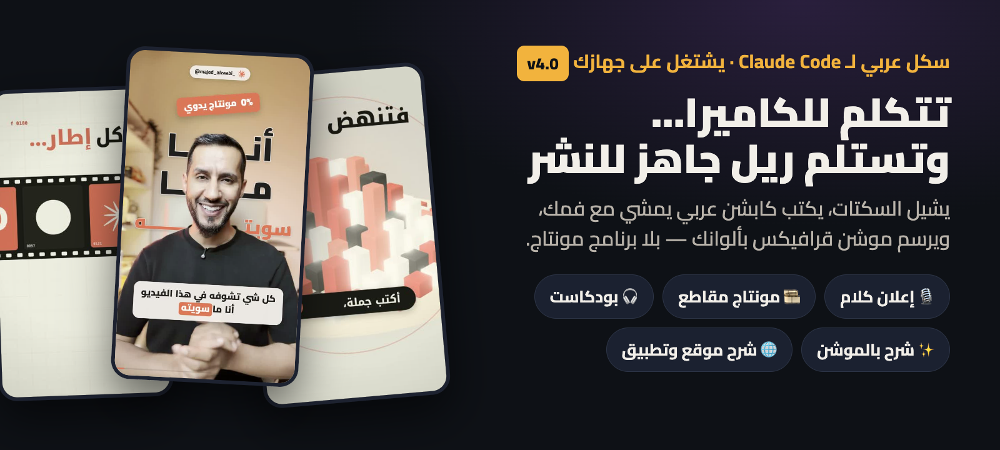</p>

<p align="center"><b>تتكلم للكاميرا… وتستلم ريل عمودي جاهز للنشر.</b><br>
يشيل السكتات، يكتب كابشن عربي يمشي مع فمك، ويرسم موشن قرافيكس بألوانك — بلا برنامج مونتاج، وفيديوك ما يطلع من جهازك.</p>

<p align="center">🎬 <b>فيديو كامل منتجه السكل:</b></p>

https://github.com/user-attachments/assets/1047c4e8-141c-4f45-b601-c58d1353fe4c

<table width="100%"><tr>
<td width="38%" align="center">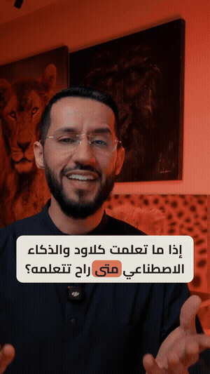</td>
<td width="62%">

### 🎬 أو خذه لدافنشي — وعدّل بإيدك
عندك **دافنشي ريزولف ستوديو**؟ نفس العقل ونفس القواعد، والمخرج تايملاين داخل مشروعك:
- **الفيديو** بمسار، **الرسم** بمسار، و**الكابشن** جملة جملة — كل قطعة تقصها وتسحبها لحالها
- **النص يتعدّل** من الإنسبكتر: الكلام، الكلمة المظلّلة، المكان، والألوان
- قل له: **«سوّه بدافنشي»**

</td></tr></table>

## ⚡ التثبيت

**داخل Claude Code — أمرين** (الخمس سكلات + المحرّك المشترك، وتتحدّث من نفس الأمر):
```
/plugin marketplace add majedphotos/video-ad-editor
/plugin install majed-video@majed-video
```

**أو ملف واحد:** [نزّل `video-ad-editor.skill`](https://github.com/majedphotos/video-ad-editor/releases/latest/download/video-ad-editor.skill) ← دبل كليك ← وافق. فيه كل الأوضاع بسكل واحد — واللي منصّب النسخة القديمة يجيه التحديث بروحه.

> 💬 **بالشات (claude.ai)؟** السكل للتخطيط بس: السكربت، خطة المونتاج، الثيم من صورك، وكابشن البوست. **المونتاج نفسه يحتاج Claude Code على جهازك.**

## 🎬 خمس سكلات — كل وحدة لشغلة

<table width="100%"><tr>
<td width="25%" align="center" valign="top">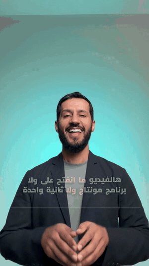<br><b>🎙️ ريل من فيديو كلام</b><br><sub>سكتات أقل · كابشن بتوقيت الكلمة · موشن من معنى كلامك</sub><br><code>«منتج هذا المقطع»</code></td>
<td width="25%" align="center" valign="top">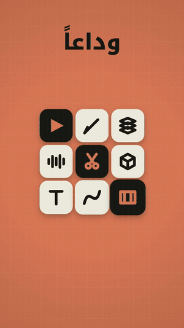<br><b>✨ شرح بالموشن</b><br><sub>فيلم 3D بـ60 فريم من نص · شرح موقع وتطبيق بآيفون وماك بوك 3D</sub><br><code>«سو فيديو موشن من هالنص»</code></td>
<td width="25%" align="center" valign="top">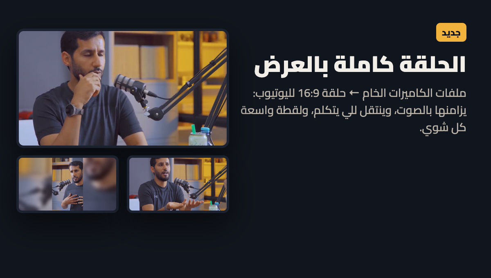<br><b>🎧 بودكاست ومقابلات</b><br><sub>كاميرتين ← ريلات بهوك مكتوب · الحلقة كاملة 16:9</sub><br><code>«سو ريلات من الحلقة»</code></td>
<td width="25%" align="center" valign="top"><br><b>🎞️ مونتاج مقاطع</b><br><sub>مجلد مقاطع بلا كلام ← ريل على الإيقاع</sub><br><code>«مونتاج من هالمقاطع»</code></td>
</tr></table>

## 🖼️ كفر وثمبنيل ينقرون بالجوال — السكل الخامس
<table width="100%"><tr>
<td width="30%" align="center">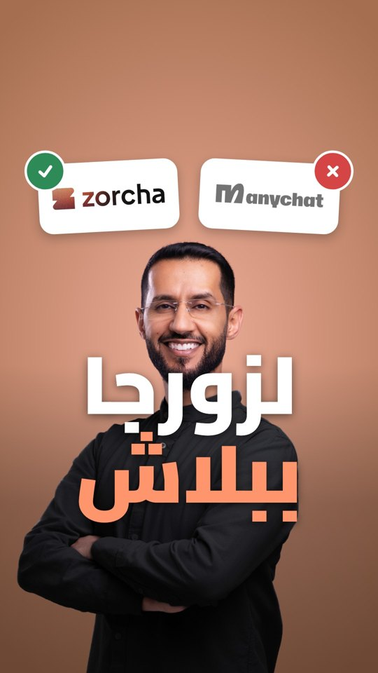<br><sub>كفر الريل = أول فريم</sub></td>
<td width="70%">

شبكة البروفايل تصغّر الكفر لـ**12٪** من حجمه — فأغلب الكفرات ما تنقرا. السكل يصمم بأحجام مقاسة على شاشة الجوال:
- **كفر الريل:** كل المهم داخل مربع 1:1 بالنص (يبين صح بالبروفايل 3:4 والفيد 4:5)، العنوان ≥ 170 بكسل و5 كلمات بالكثير — ويتركّب **أول فريم بالفيديو**
- **ثمبنيل يوتيوب:** ثلاث أفكار بـ3840×2160 — وجه كبير، هوك قصير، وتحت يمين فاضي لمدة الفيديو
- **معاينة بحجمه الحقيقي بالجوال** قبل ما تنشر
- قل له: **«سو كفر»** أو **«ثمبنيل يوتيوب»**

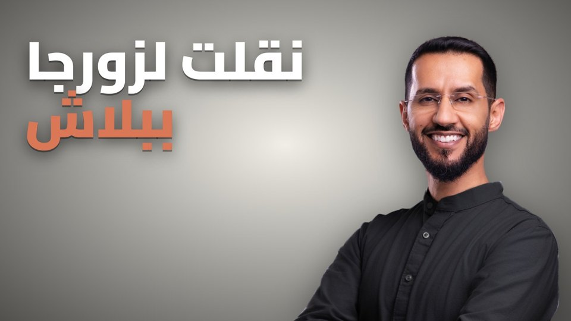

</td></tr></table>

## ✂️ امسح من الكلام — ينقص من الفيديو
بعد التفريغ يطبع لك كلامك جملة جملة. تقول له **«شيل 5 و8»** — ويقصهم من الفيديو والصوت، والكابشن يمشي معاه. غيّرت رايك؟ **«رجّعها»**. ويكشف بروحه الجمل اللي قلتها مرتين.

## 🧭 يتعرّف على ذوقك — أول مرة بس
<p align="center">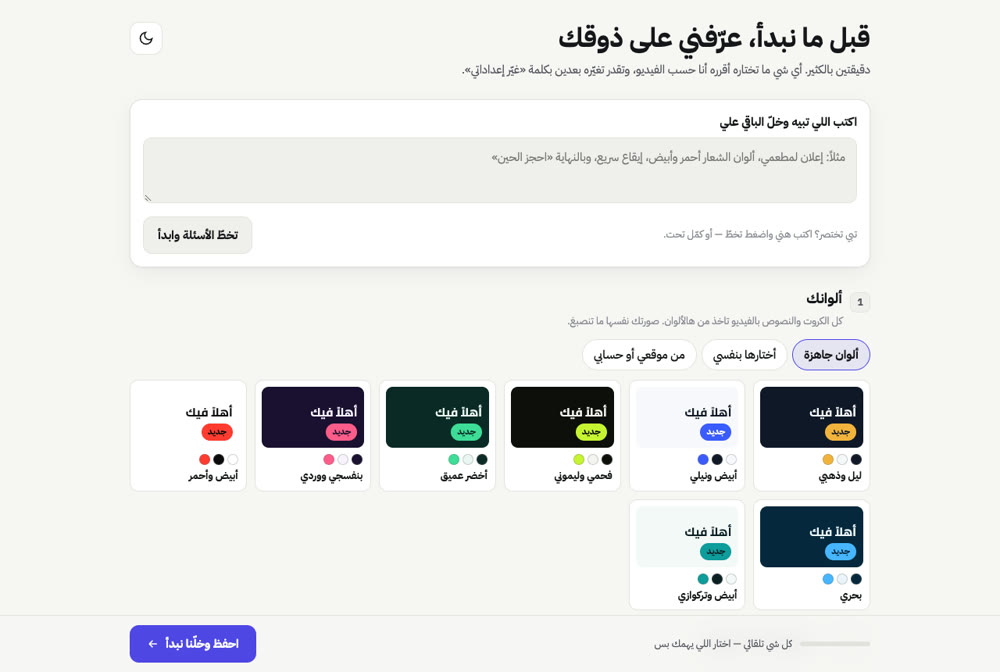</p>

صفحة صغيرة تختار فيها ألوانك، الخط، ستايل الكابشن، الإيقاع، والصوت — أو تكتب اللي تبيه وتخطّاها. كل فيديو بعدها يمشي على ذوقك.

## 🎚️ تايملاين تعدّل عليه — من الكمبيوتر أو الجوال
<p align="center">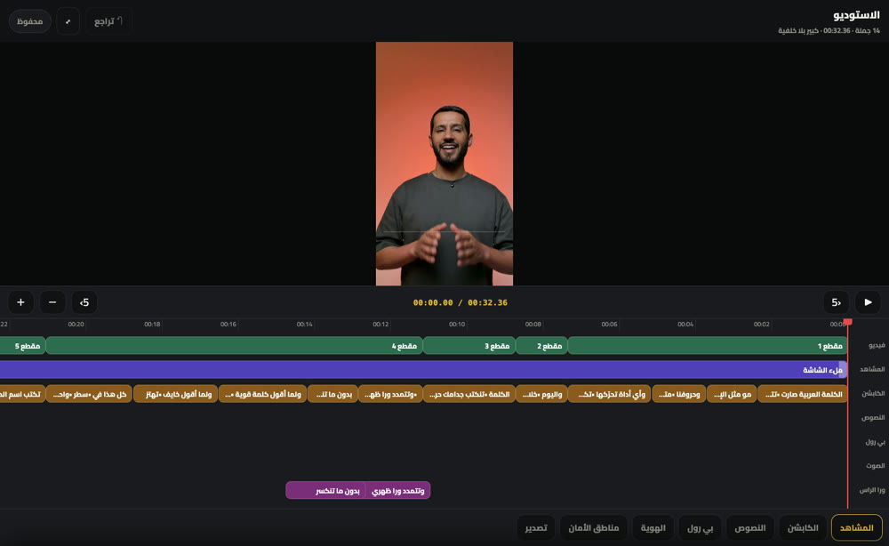 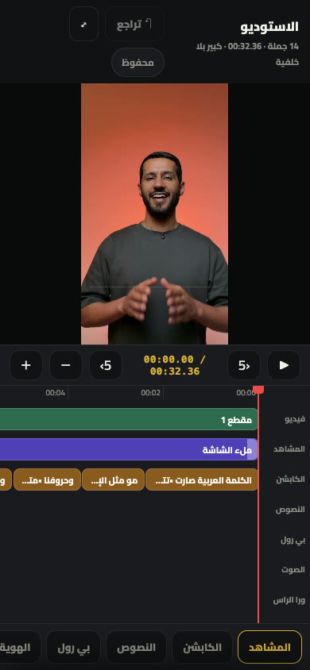</p>

كلود يسوي المونتاج، وانت تعدّل بإيدك: تقص، تغيّر ستايل الكابشن، تحط مؤثر على كلمة، ترفع بي-رول من جوالك — وكل تعديل ما يصرف توكنز. تبي تحكم كامل بكل فريم؟ **«افتحه بريموشن»**:

<p align="center">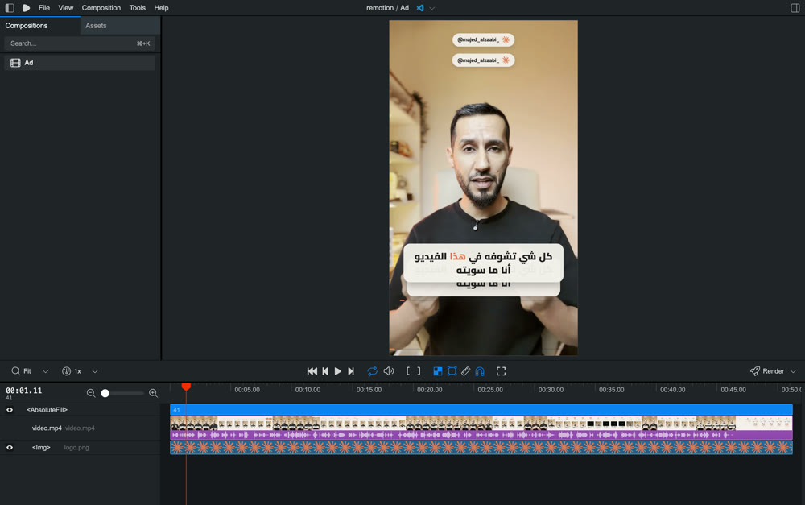</p>

## 🔌 استخدم اللي عندك
عندك اشتراك بمنصة توليد (fal · Higgsfield · ElevenLabs · أو غيرها) وكونكتورها مركّب بكلود؟ قل له يستخدمها — يولّد منها البي-رول أو الصوت أو المشاهد ويركّبها بالمونتاج. ما عندك؟ يشتغل عادي بدونها.

## 🆕 جديد في 4.1
- **سكل الكفر والثمبنيل** (`thumbnail-video`) — أحجام تنقرا بالجوال (مقاسة + بحث)، كفر أول فريم، وثمبنيل يوتيوب بثلاث أفكار.

## جديد في 4.0
- **أربع سكلات بمحرّك واحد** بدل سكل واحد ثقيل — كل وضع يقرا تعليماته بس.
- **صفحة التعارف** صارت للكل.
- **وضع دافنشي** صار للكل — وقابل للتعديل: كل شي قطعة على مساره.
- **تعليمات مرتبة** — الملف الرئيسي أخف بـ38٪.
- **اختبار آلي** يمر على كل الخطوات قبل أي إصدار.

## 🗣️ قل له

| تبي | اكتب |
|---|---|
| ريل من فيديو تتكلم فيه | «منتج هذا المقطع» |
| نفس الريل بدافنشي | «سوّه بدافنشي» |
| مونتاج من مقاطع | «مونتاج من هالمقاطع» |
| ريلات من بودكاست | «سو ريلات من الحلقة» |
| الحلقة كاملة لليوتيوب | «الحلقة كاملة بالعرض» |
| فيديو موشن من نص | «سو فيديو موشن من هالنص» |
| شرح موقع | «اشرح هالموقع بفيديو: الرابط» |
| ثيم من صور | أرسل الصور + «أبي ستايل جذي» |
| كفر أو ثمبنيل | «سو كفر» · «ثمبنيل يوتيوب» |
| تعدّل بنفسك | «افتح الاستوديو» |
| تغيّر ذوقك | «غيّر إعداداتي» |

## 🔧 المتطلبات
السكل ينزّلها بنفسه بعد إذنك: **ffmpeg** (القص والصوت) · **Whisper** (التفريغ بتوقيت الكلمة) · **Chrome** (الرسم). ماك وويندوز. وضع دافنشي يحتاج **دافنشي ريزولف ستوديو 21.1** أو أحدث.

## 🔒 الخصوصية
كل شي على جهازك. **فيديوك ما يرتفع لأي سيرفر.** الاستثناءات اختيارية وتشغّلها أنت (المشاهد المولّدة بالذكاء الاصطناعي).

## 🎓 السكل مجاني — الدورة تعلّمك شلون تسوي مثله وأكثر
كل اللي فوق انبنى بكلود. بالدورة تتعلم شلون تبني أدواتك انت: سكلات، أتمتة، ومحتوى يشتغل لك — من الصفر وبالعربي.

<p align="center">
  <a href="https://www.dawrat.com/course/ahtrf-klwd-90f4">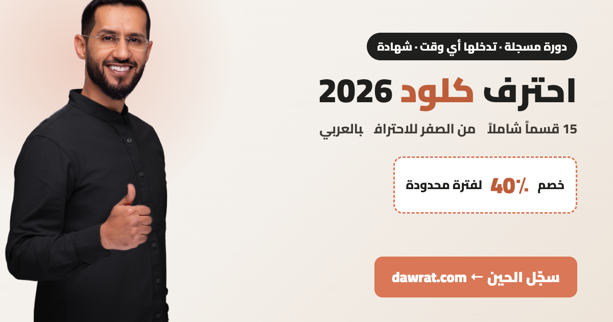</a>
  <a href="https://www.instagram.com/channel/Abb1FvYoeUSGuaVM/">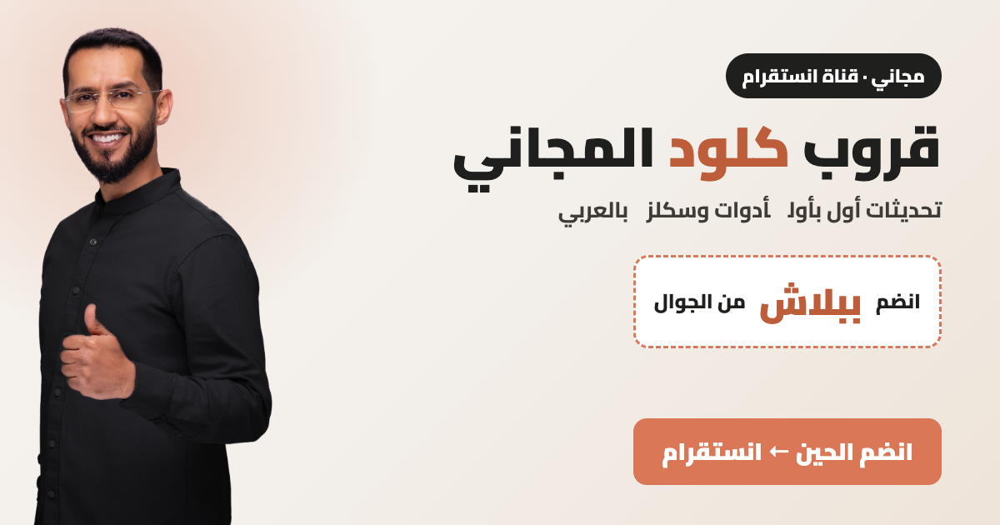</a>
</p>

## 🛠️ للمطوّرين
خريطة كل السكربتات والملفات: [`references/script-map.md`](video-ad-editor/references/script-map.md) · التعليمات: [`SKILL.md`](video-ad-editor/SKILL.md) · السكلات الثانية: [`motion-video`](motion-video/SKILL.md) · [`podcast-video`](podcast-video/SKILL.md) · [`montage-video`](montage-video/SKILL.md) · [`thumbnail-video`](thumbnail-video/SKILL.md)

<details><summary>الإصدارات السابقة</summary>

- **3.9** الثيم من صور مرجعية · البودكاست كامل 16:9 · شرح موقع/تطبيق + آيفون وماك بوك 3D · كفر الريل · تنظيف صوت ذكي
- **3.8** شرح بالموشن 3D · هوك البودكاست · «طبقات» · مؤثرات الإيقاع
- **3.6-3.7** حزمة الموشن · الموشن من معنى الجملة
- **3.5** حلقة كاملة ← ريلات
- **3.4** الاستوديو (تايملاين باليد)
- **3.3** أخف وأنظف · **3.2** مشاهد مولّدة · **3.1** حركات الكلمة العربية
- **3.0** يحدّث نفسه · **2.9** تسجيل الشاشة بإطار جوال · **2.8** ويندوز (بمساهمة [@thefhiter](https://github.com/thefhiter)) · **2.7** البودكاست
</details>

## الرخصة
MIT — استخدمه وعدّله ووزّعه بحرية.

</div>
